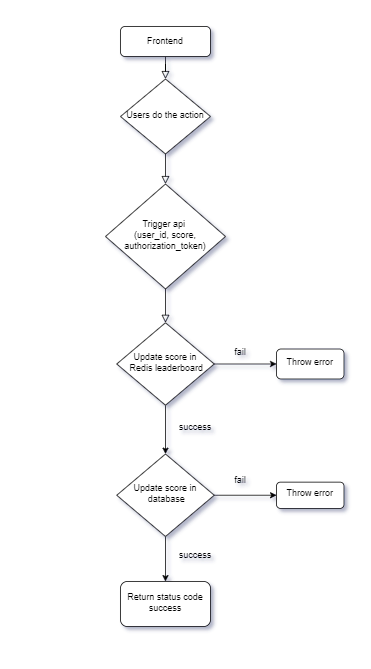

# Score Update Module with Redis Leaderboard

This module manages user score updates upon action completion, enabling live scoreboard updates, preventing unauthorized score manipulation, and leveraging Redis for efficient leaderboards.

## Functionality

Takes a user ID, score delta, and authorization token as input.
Validates the inputs and authorization.
Increments the user's score by the specified delta in Redis for real-time updates.
Optionally updates the score in the main database asynchronously for long-term storage.
Returns success/failure status and (optional) updated score.
Security:

Robust authentication using authorization tokens.
Input validation to prevent malicious data.
Consider rate limiting for excessive updates.
Usage:

## Frontend

Upon user action completion, make an API call to the score update endpoint.
Provide user_id, score_delta, and a valid authorization_token.

## Backend

Validate the inputs and authorization token.
Update the user's score in the Redis leaderboard.
Optionally update the score in the main database asynchronously.
Respond to the frontend with success/failure status and (optional) updated score.

## Error Codes

400: Bad Request (invalid input)
401: Unauthorized (invalid or missing authorization token)
500: Internal Server Error (unexpected error)

## Additional Notes

Unit and integration testing are crucial for this module.
Consider caching frequently accessed leaderboard data.
Improvements:

Define specific validation rules (e.g., minimum/maximum score delta).
Implement granular authorization (e.g., only specific actions update scores).
Explore leaderboards for more than the top 10 scores (already implemented with Redis).
Utilize Redis leaderboards for real-time score updates and efficient ranking.

## Future Enhancements

Ranked score updates based on specific actions or criteria.
Real-time score updates using WebSockets or Server-Sent Events (SSE) (can be facilitated by updates in the Redis leaderboard).

